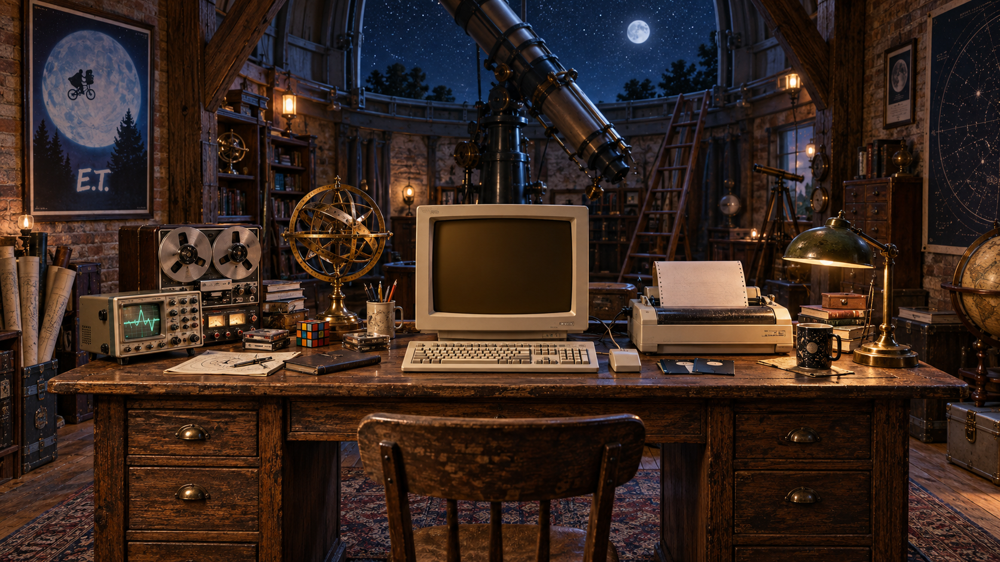

THE EMPIRICAL ARCHITECTURE · DANIEL JOHN MURRAY

# The universe leaves clues.

*Some questions deserve a laboratory.*

Explore the research files. Bring a question to the terminal. Collect your report.

<strong>Open the scientific record · programme, papers and reproducible work</strong>

# Daniel John Murray · The Empirical Architecture

**[Enter the live Observatory](https://empirical-observatory.madmanmuzza.chatgpt.site) · [Projects on GitHub](https://github.com/thantiklermcirony/empirical-architecture/blob/main/CURRENT_PROJECTS.md)**

**Latest contribution: [Ray Serve controller recovery — PR #66039](https://github.com/ray-project/ray/pull/66039).** In a real Linux HTTP experiment, the original returned the wrong application in all 60 probes; the candidate returned the new application in all 60. Thirty selected Linux tests and the source checks pass, with 14 new cases also passing on Windows. One CPU node was tested. Submitted after human review and local tests; awaiting maintainer review. [Evidence and limits](https://github.com/thantiklermcirony/empirical-architecture/blob/main/research/ray-campaign/Ray_Contribution_Report.md).

**Also submitted: [NeuroGym decision cue — PR #295](https://github.com/neurogym/neurogym/pull/295).** A task could require different answers after identical visible histories. Our proposed correction makes its intended action window observable. All 132 candidate-suite tests pass on the tested Windows/Python 3.12 runtime; 240 seeded trials preserve all other observation channels, targets and timings. [Results and reproduction](https://github.com/thantiklermcirony/empirical-observatory/blob/main/public/research/NeuroGym_Contribution_Report.md). Submitted for maintainer review; not merged.

Earlier contributions: [Pertpy biological evaluator](https://github.com/scverse/pertpy/pull/1098), [Graphiti history](https://github.com/getzep/graphiti/pull/1867) and [Graphiti timestamps](https://github.com/getzep/graphiti/pull/1866). All remain submitted for review. [Next three contribution investigations](https://github.com/thantiklermcirony/empirical-observatory/blob/main/public/research/Next_Big_Three.md).

### A minimal architecture for science, life and intelligence

We are building common mathematical and computational foundations for how science represents reality, discovers laws and turns knowledge into action.

The programme studies what makes a scientific description adequate: what it must remember, which transformations it can represent, what observations conceal, and which futures remain accessible. It connects predictive state and geometry with adaptation, ecology, consciousness research and scientific AI.

**[Start with The Empirical Architecture →](https://github.com/thantiklermcirony/empirical-architecture)**

| Explore | What you will find |
|---|---|
| [The programme](https://github.com/thantiklermcirony/empirical-architecture/blob/main/research/PROGRAMME.md) | The science-wide scope, shared foundations and domain research questions. |
| [41 manuscripts](https://github.com/thantiklermcirony/empirical-architecture/blob/main/corpus/README.md) | A navigable corpus with source records and research roles. |
| [Run the reference examples](https://github.com/thantiklermcirony/empirical-architecture#start-with-four-small-experiments) | Four offline demonstrations of state, transformation, ecological currents and evidence. |
| [Scientific AI](https://github.com/thantiklermcirony/empirical-architecture/blob/main/research/AI.md) | The architectural thesis and the comparative benchmark it needs to meet. |
| [IDA / StateAtlas](https://github.com/thantiklermcirony/ida-stateatlas) | The developing experimental instrument: discovery lab, research atlas and R1 engineering baseline. |

The ambition is a revolution in scientific representation and discovery. Progress is established through precise mathematics, discriminating experiments, usable tools and independent reproduction.

**Contribute a result:** reproduce an example, identify a counterexample, formalize a theorem, build a model adapter or propose a decisive experiment. [Contribution guide](https://github.com/thantiklermcirony/empirical-architecture/blob/main/CONTRIBUTING.md).

